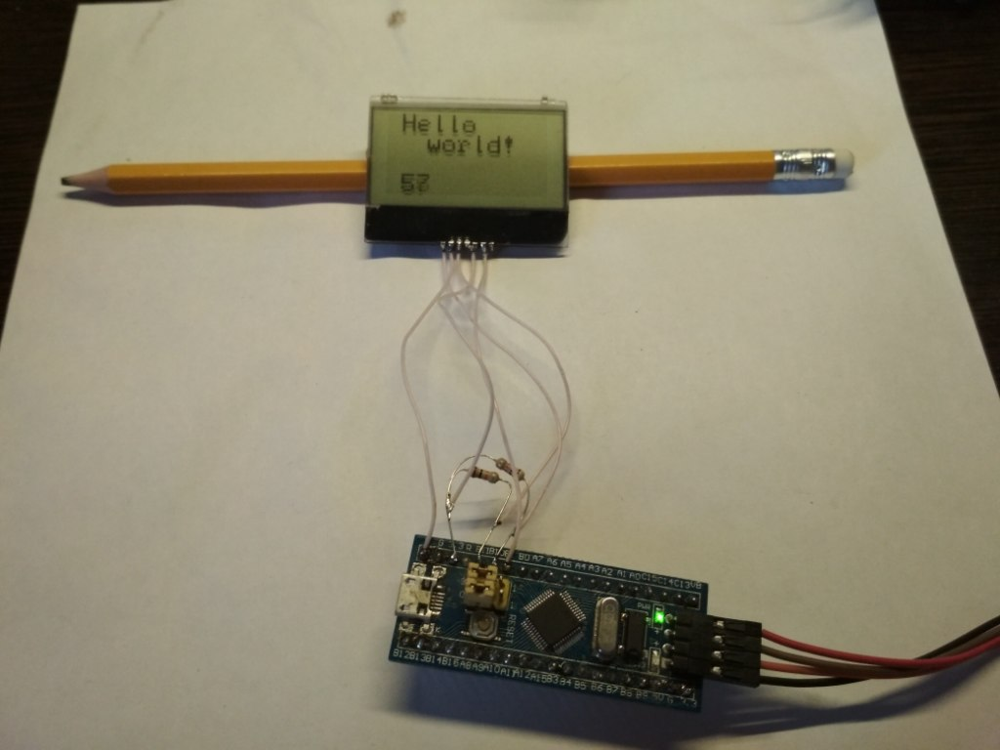

# Example of the STM32f1 with TIC120 display.

The TIC120 display documentation: http://invent-systems.narod.ru/_pdf/TIC120.pdf

The TIC120 display uses a PCF8531 controller. Here is the documentation for this: https://www.nxp.com/docs/en/data-sheet/PCF8531.pdf

